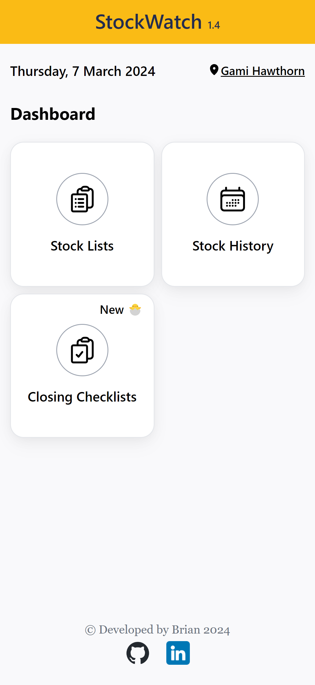
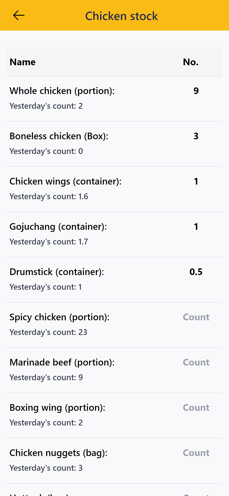
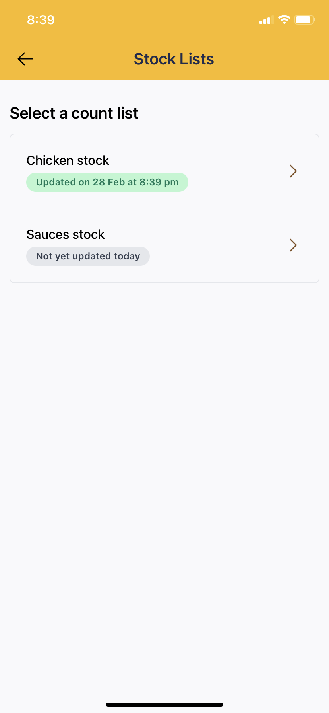
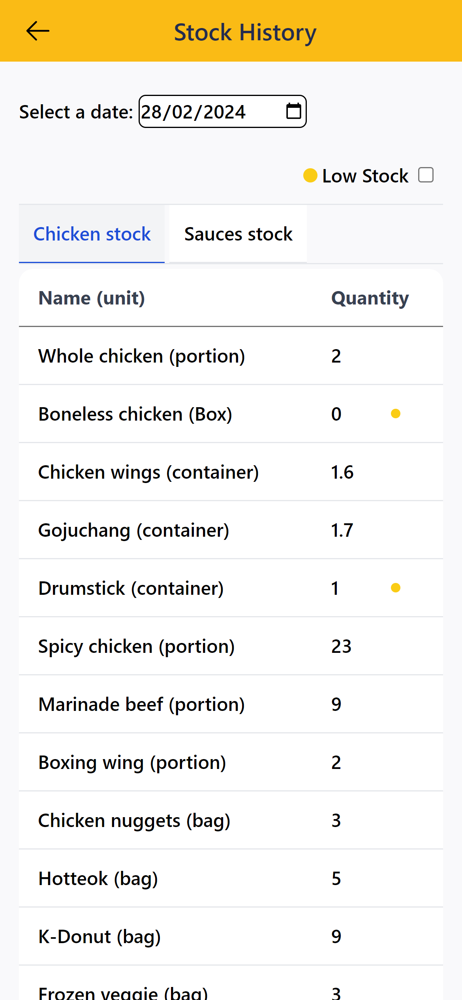
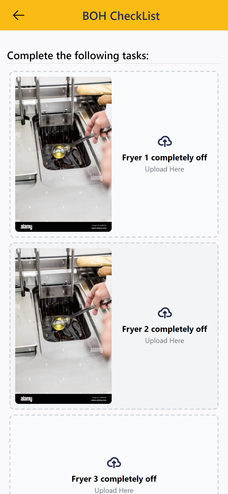
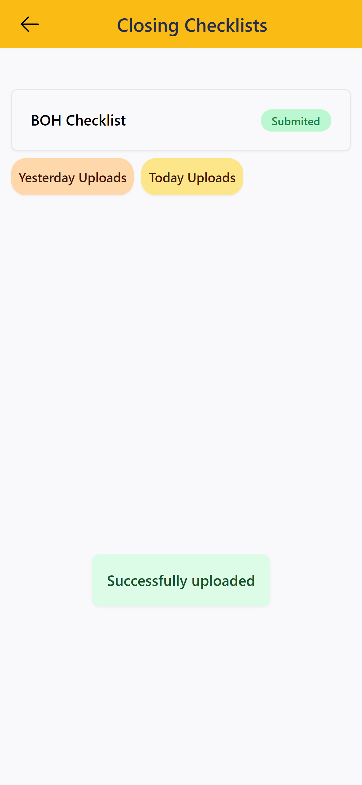
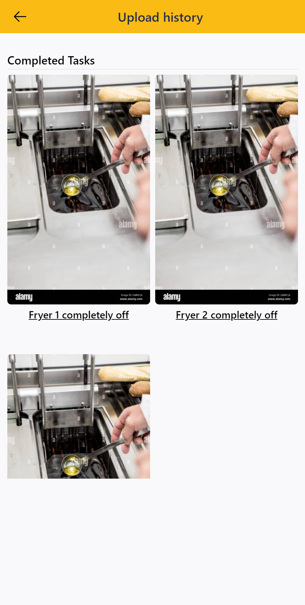

# StockWatch: Stock Management and Checklist Verification

StockWatch is an application designed to specifically streamline stock management and checklist verification for **[Gami Chicken and Beer](https://www.gamichicken.com.au/restaurant/hawthorn/) located in Hawthorn, Victoria**. Built using React (TypeScript), Firebase, and Tailwind CSS, StockWatch provides a user-friendly interface for restaurant staff to efficiently manage stock levels and complete checklists.

## Features

- **Real-time Inventory Tracking**: track and manage stock quantities with instant updates.
- **Track Inventory History & Verify Tasks with Photos**: View historical data and verify completion of tasks like stock checks and cleaning by capturing photos.
- **Review Past Inventory and Checklist Data By Date**

## Technologies

- **Frontend**:
  - [React.js](https://react.dev/) with TypeScript
  - [Tailwind](https://tailwindcss.com/) for styling
  - [React Router](https://reactrouter.com/en/main) *version 6* for routing
- **Backend**:
  - [Firebase](https://firebase.google.com/) (Firestore for the database, Firebase Storage for storing pictures)
- **Hosting**:
  - [Firebase Hosting](https://firebase.google.com/docs/hosting)

## Demo

- Live demo:

    <https://www.youtube.com/watch?v=STfpD1Epv-I>

    *Press play to see the video*

## Usage

- **Dashboard**

    

&nbsp;

- **Use the dashboard to navigate to stock lists to update a specific stock**

    
    

&nbsp;

- **Stock are recorded and can be viewed by date in *Stock History***

    

&nbsp;

- **Navigate to *Closing Checklists* to complete tasks for the day**

    
    

&nbsp;

- **The user can check if the assigned tasks have been completed properly by clicking *Yesterday Uploads* or *Today Uploads***

    

&nbsp;

## Installation

1. Clone the repository:

   ```bash
   git clone https://github.com/Brian3010/stockwatch.git
   ```

2. Navigate to the project directory:

   ```bash
   cd stockwatch
   ```

3. Install dependencies:

   ```bash
   npm install
   ```

4. Start the development server:

   ```bash
   npm run dev
   ```

5. Access the application at [http://localhost:3000](http://localhost:3000) in your web browser.

## Contact

Feel free to reach out if you have any questions, suggestions, or just want to connect! You can contact me via:

- **Email:** [briannguyenwg@gmail.com](mailto:briannguyenwg@gmail.com)
- **LinkedIn:** [https://www.linkedin.com/in/brian-nguyen-411483196/](https://www.linkedin.com/in/brian-nguyen-411483196/)
- **GitHub:** [https://github.com/Brian3010](https://github.com/Brian301)
