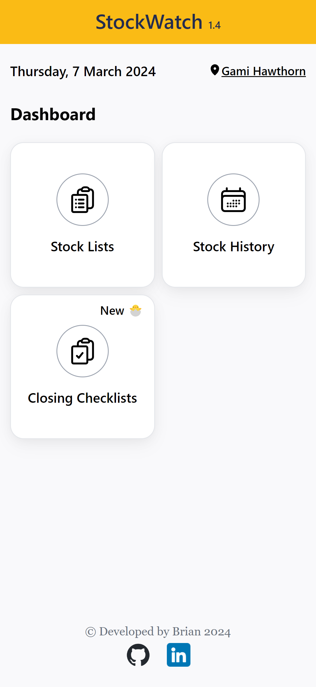
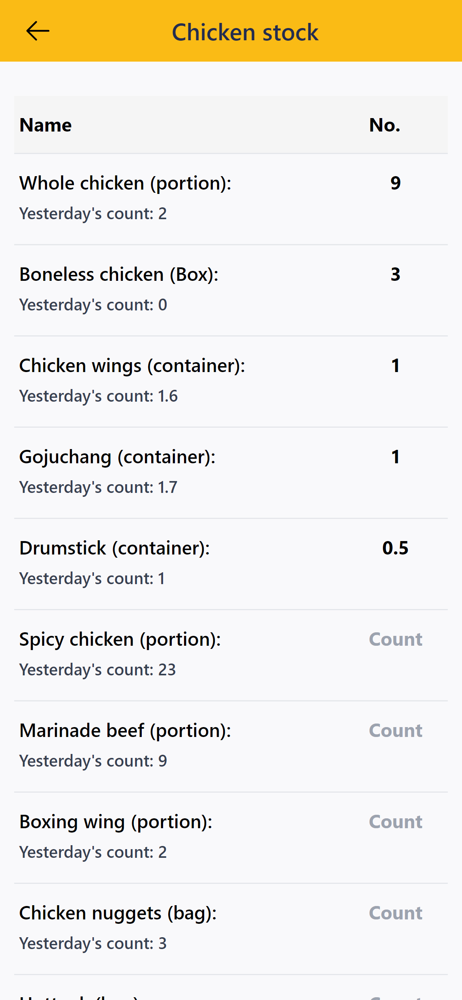
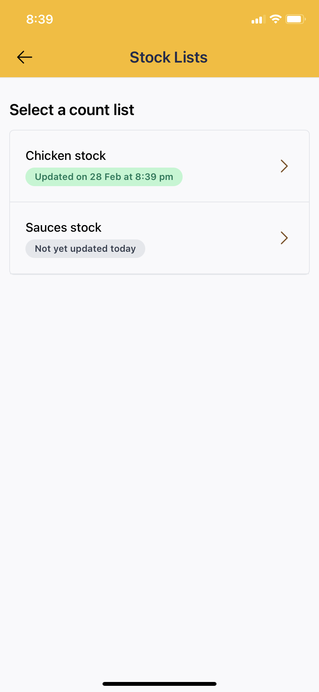
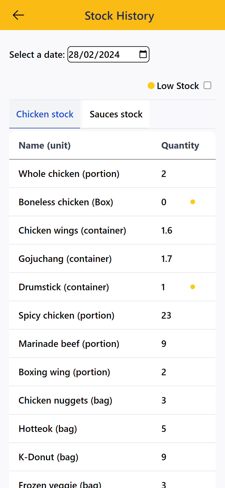
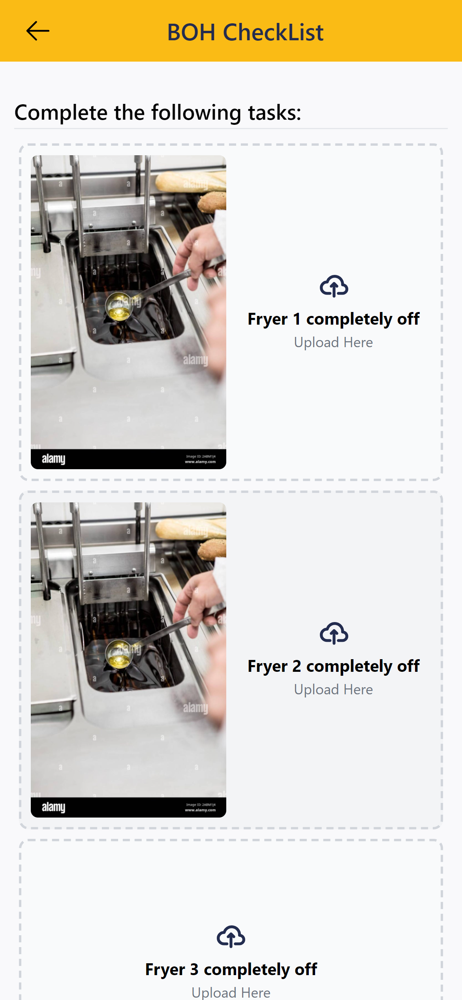
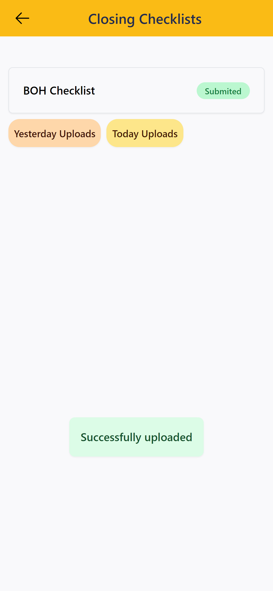
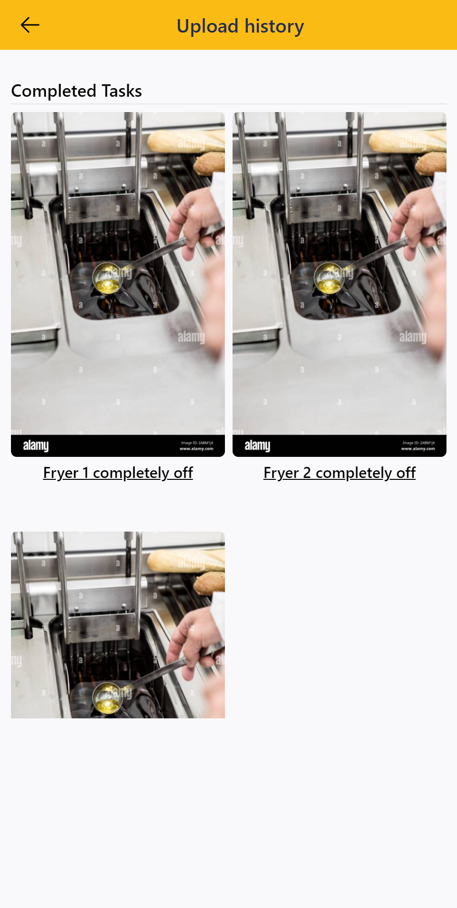

# StockWatch

> A full-stack inventory management and task verification web application built for a real-world restaurant client.

[](https://react.dev/)
[](https://www.typescriptlang.org/)
[](https://firebase.google.com/)
[](https://tailwindcss.com/)
[](https://vitejs.dev/)

---

## Overview

StockWatch was built to solve a real operational problem at **[Gami Chicken and Beer (Hawthorn, VIC)](https://www.gamichicken.com.au/restaurant/hawthorn/)** — manually tracking daily stock counts and closing tasks was error-prone and time-consuming. This app replaces paper-based processes with a mobile-friendly web interface that restaurant staff use every shift.

The project demonstrates end-to-end ownership: requirements gathering from a real client, UI/UX design, full-stack development, and cloud deployment.

---

## Key Features

| Feature | Description |
|---|---|
| 📦 **Real-time Inventory Tracking** | Staff update stock quantities directly from their phones; changes sync instantly via Firestore. |
| 📅 **Inventory History by Date** | Managers can browse past stock submissions filtered by date for accountability and auditing. |
| ✅ **Closing Checklist with Photo Verification** | Staff mark tasks complete and upload photos as proof; managers can review today's and yesterday's uploads. |
| 🖼️ **Client-side Image Compression** | Photos are compressed in the browser before uploading to Firebase Storage, reducing storage costs and improving upload speed. |
| ⚡ **Responsive Mobile-first Design** | Fully usable on phones — the primary device used by kitchen staff during their shift. |

---

## Tech Stack

### Frontend
- **React 18** with **TypeScript** — component-based UI with strong typing
- **React Router v6** — client-side routing with nested layouts
- **Tailwind CSS** — utility-first styling with a custom responsive grid
- **Headless UI** — accessible UI primitives (dropdowns, dialogs)
- **Vite** — fast development server and optimised production builds

### Backend & Infrastructure
- **Firebase Firestore** — NoSQL real-time database for stock and task records
- **Firebase Storage** — cloud storage for task verification photos
- **Firebase Hosting** — production deployment via CLI

### Tooling
- **ESLint** + **Prettier** — enforced code style and linting
- **browser-image-compression** — client-side image optimisation before upload

---

## Architecture Highlights

- **Custom React Hooks** — reusable logic extracted into `useInputFields`, `useFlashMessage`, and `useHorizontalScroll` to keep components clean.
- **Context API** — `FlashMessageProvider` delivers global UI feedback (success/error toasts) across the component tree without prop drilling.
- **Modular Firebase layer** — all Firestore and Storage calls are separated into dedicated modules (`fetchStock`, `fetchTasks`, `updateStock`, `uploadTasks`), keeping business logic out of components.
- **Type-safe throughout** — TypeScript interfaces are defined for all data models, API responses, and component props.

---

## Demo

▶️ Watch the full walkthrough:

[](https://www.youtube.com/watch?v=STfpD1Epv-I)

---

## Screenshots

**Dashboard**



&nbsp;

**Stock List — Counting & Submitting Stock**




&nbsp;

**Stock History — Browse Records by Date**



&nbsp;

**Closing Checklist — Task List & Submission**




&nbsp;

**Closing Checklist — Reviewing Uploaded Photos**



---

## Getting Started

### Prerequisites

- Node.js ≥ 18
- A Firebase project with Firestore and Storage enabled

### Installation

1. Clone the repository:

   ```bash
   git clone https://github.com/Brian3010/StockWatchApp.git
   cd StockWatchApp
   ```

2. Install dependencies:

   ```bash
   npm install
   ```

3. Create a `.env` file in the project root and add your Firebase config:

   ```env
   VITE_FIREBASE_API_KEY=your_api_key
   VITE_FIREBASE_AUTH_DOMAIN=your_auth_domain
   VITE_FIREBASE_PROJECT_ID=your_project_id
   VITE_FIREBASE_STORAGE_BUCKET=your_storage_bucket
   VITE_FIREBASE_MESSAGING_SENDER_ID=your_sender_id
   VITE_FIREBASE_APP_ID=your_app_id
   ```

4. Start the development server:

   ```bash
   npm run dev
   ```

5. Open [http://localhost:5173](http://localhost:5173) in your browser.

---

## Scripts

| Command | Description |
|---|---|
| `npm run dev` | Start the Vite development server |
| `npm run build` | Type-check and build for production |
| `npm run preview` | Preview the production build locally |
| `npm run lint` | Run ESLint across all TypeScript files |

---

## Contact

I'm actively looking for opportunities as a software developer. Feel free to reach out!

- **Email:** [briannguyenwg@gmail.com](mailto:briannguyenwg@gmail.com)
- **LinkedIn:** [linkedin.com/in/brian-nguyen-411483196](https://www.linkedin.com/in/brian-nguyen-411483196/)
- **GitHub:** [github.com/Brian3010](https://github.com/Brian3010)
